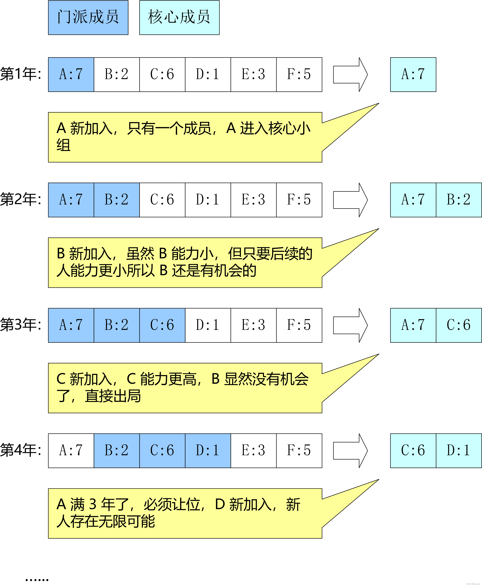

## LC 3. Longest substring without repeating characters
```python
def lengthOfLongestSubstring_SlidingWindow(s: str) -> int:
    i, j, ans = 0, 0, 0
    m = collections.defaultdict(int)
    while j < len(s):
        cj = s[j]
        m[cj] += 1
        while m[cj] > 1 and i < j:
            ci = s[i]
            m[ci] -= 1
            i += 1
        j += 1
        ans = max(ans, j - i)

def lengthOfLongestSubstring(s: str) -> int:
    i, j, ans = 0, 0, 0
    m = dict()
    while j < len(s):
        c = s[j]
        if c in m:
            ans = max(ans, j - i)
            i = max(m[c]+1, i) ## jump to the right of previously repeating one
        m[c] = j
        j += 1
    ans = max(ans, j - i)
    return ans
```

## LC 76. Minimum window substring
https://leetcode.com/problems/minimum-window-substring/description/


## LC 5. Longest palindromic substring


# Monotone Queue
假设有一个江湖门派：每个人最多在门派中待K年、同时每年都会有一个新成员加入。门派中能力最高（能力用数字表示）的人为当年的掌门，同时要培养未来的掌门人，掌门及未来掌门构成了门派的核心成员。

如上图所示，门派中核心成员小组人员维护规则如下：
- 满期限的成员必须从核心小组中退出
- 新成员代表着未来必须加入核心小组
- 若核心小组中老成员能力比新成员小则直接出局

## LC 239. Sliding window maximum
```python
def maxSlidingWindow(nums: List[int], k: int) -> List[int]:
    ans = []
    mq = collections.deque()
    for j in range(len(nums)):
        while mq and nums[mq[-1]] <= nums[j]:
            mq.pop()
        mq.append(j)
        if mq[0] <= j - k:
            mq.popleft()
        if j + 1 >= k:
            ans.append(nums[mq[0]])
    return ans
```