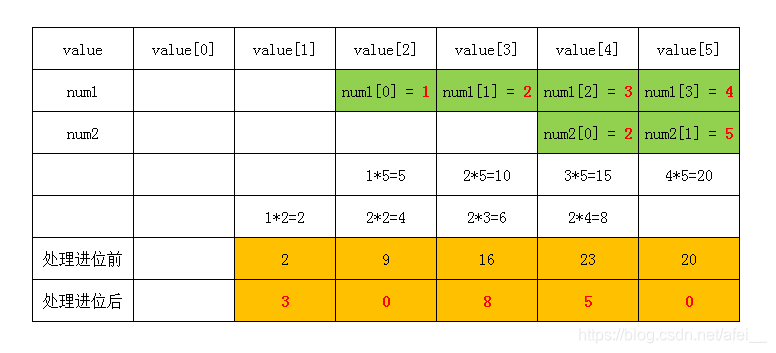

## LC 43. Multiply strings
- The result would not exceed len(num1)+len(num2), thus we can have a result array of length (n1 + n2).
- Elementary school multiplication, e.g., 1234 * 25:

- Propagate carries from the least significant digit.
- Remove leading zeros (expect the possible last one).